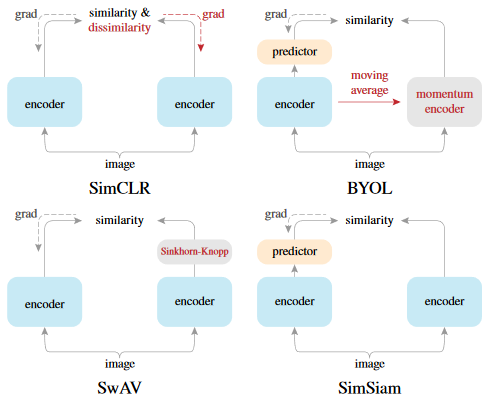

# simsiam-pytorch
Minimal PyTorch Implementation of SimSiam from ["Exploring Simple Siamese Representation Learning" by Chen et al.](https://arxiv.org/abs/2011.10566)

<p align="center"></p>


### Load and train on a custom dataset

```python
from simsiam.models import SimSiam
from simsiam.losses import negative_cosine_similarity

model = SimSiam(
    backbone="resnet50",    # encoder network
    latent_dim=2048,        # predictor network output size
    proj_hidden_dim=2048    # projection mlp hidden layer size
    pred_hidden_dim=512     # predictor mlp hidden layer size
)
model = model.to("cuda")    # use all the parallels
model.train()

transforms = ...
dataset = ...
dataloader = ...
opt = ...

for epoch in range(epochs):
    for batch, (x, y) in enumerate(dataloader):
        opt.zero_grad()

        x1, x2 = transforms(x), transforms(x)           # Augment
        e1, e2 = model.encode(x1), model.encode(x2)     # Encode
        z1, z2 = model.project(e1), model.project(e2)   # Project
        p1, p2 = model.predict(z1), model.predict(z2)   # Predict

        # Compute loss
        loss1 = negative_cosine_similarity(p1, z1)
        loss2 = negative_cosine_similarity(p2, z2)
        loss = loss1/2 + loss2/2
        loss.backward()
        opt.step()

# Save encoder weights for later
torch.save(model.encoder.state_dict(), "pretrained.pt")
```

### Use pretrained weights in a classifier

```python
from simsiam.models import ResNet

# just a wrapper around encoder + linear classifier networks
model = ResNet(
    backbone="resnet50",    # Same as during pretraining
    num_classes=10,         # number of output neurons 
    pretrained=False,       # Whether to load pretrained imagenet weights
    freeze=True             # Freeze the encoder weights (or not)
)

# Load the pretrained weights from SimSiam
model.encoder.load_state_dict(torch.load("pretrained.pt"))

model = model.to("cuda")
model.train()

transforms = ...
dataset = ...
dataloader = ...
opt = optim.SGD(model.parameters())
loss_func = nn.CrossEntropyLoss()

# Train on your small labeled train set
for epoch in range(epochs):
    for batch, (x, y) in enumerate(dataloader):
        opt.zero_grad()
        y_pred = model(x)
        loss = loss_func(y_pred, y)
        loss.backward()
        opt.step()

```

### Install dependencies

```bash
pip install -r requirements.txt

```

### Train on STL-10 dataset

Modify pretrain.yaml to your liking and run

```python
python pretrain.py --cfg configs/pretrain.json

```

### View logs in tensorboard

```python
tensorboard --logdir=logs

```
